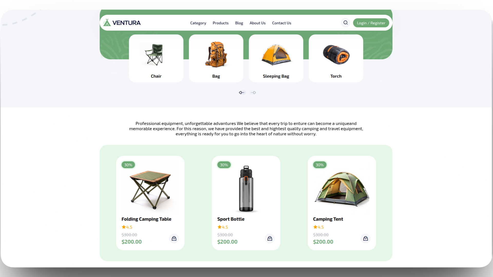
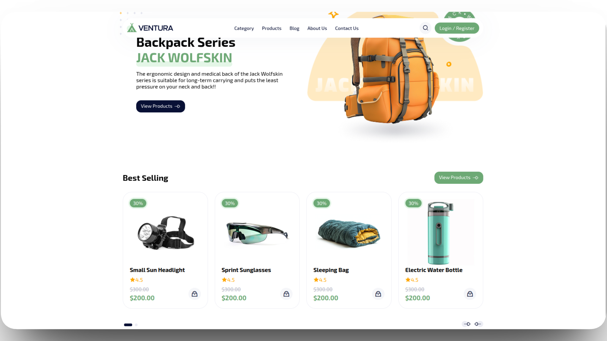

# ventura

Ventura is a responsive, modern landing page for a camping and outdoor equipment e-commerce website. This project is built using HTML, CSS, and JavaScript, focusing on a clean user interface and smooth user experience with interactive elements.

### Project Demo





## Features

- **Fully Responsive Design:** Adapts seamlessly to various screen sizes, from mobile phones to desktops.
- **Hero Section:** A welcoming top section with a background image and a prominent call-to-action button.
- **Interactive Carousels:** Utilizes Swiper.js to create touch-friendly, autoplaying sliders for both product categories and best-selling items, complete with navigation controls.
- **Dynamic Navigation:** A fixed navigation bar that includes a mobile-friendly hamburger menu for easy navigation on smaller devices.
- **Product Showcase:** Multiple sections to display products, including a grid for general products, a dedicated section for a featured backpack series, and a slider for best-selling items.
- **Modern UI/UX:** A clean layout with custom-styled elements, CSS variables for easy theming, and smooth transitions.

## Technologies Used

- **HTML5:** For the structure and content of the website.
- **CSS3:** For styling, layout, and responsiveness.
- **JavaScript:** For client-side interactivity, including the navigation menu toggle and slider initialization.
- **Swiper.js:** A powerful library for creating touch-enabled sliders and carousels.
- **Remix Icon:** A comprehensive set of open-source neutral-style system symbols for icons.

## Getting Started

To get a local copy up and running, follow these simple steps.

### Prerequisites

You only need a modern web browser to view the project.

### Installation

1.  Clone the repository to your local machine:
    ```bash
    git clone https://github.com/0xbelal/ventura.git
    ```
2.  Navigate to the project directory:
    ```bash
    cd ventura
    ```
3.  Open the `index.html` file in your web browser to view the website.

## File Structure

The repository has a straightforward structure:

```
├── index.html          # Main HTML file for the landing page
├── css/
│   └── style.css       # All custom styles for the website
├── js/
│   └── main.js         # JavaScript for interactivity and Swiper.js setup
└── images/             # Contains all images used in the project
```
